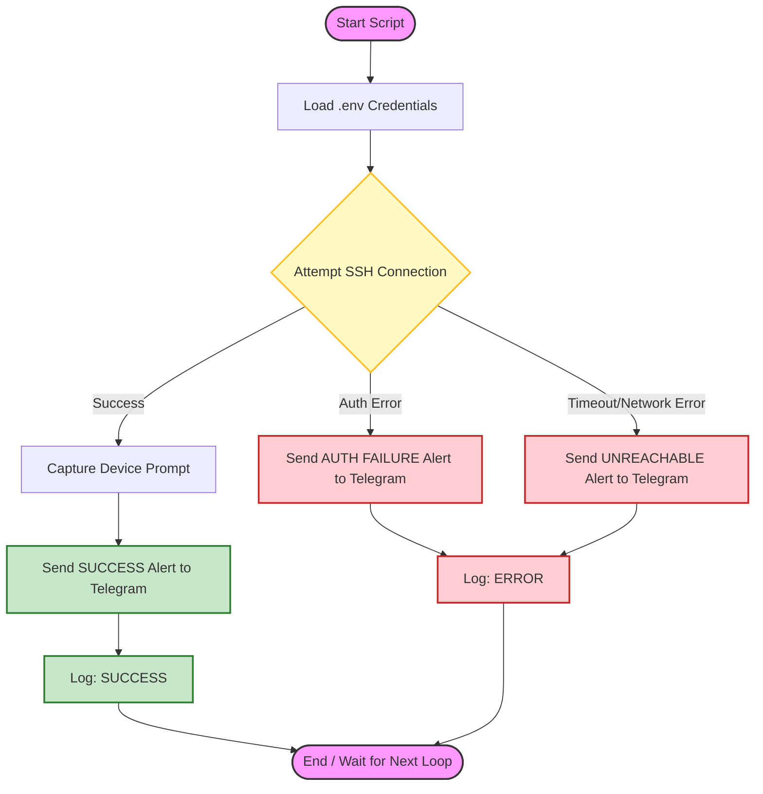
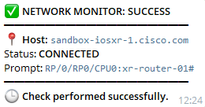
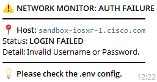
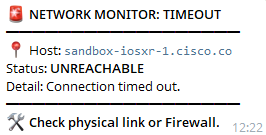

# Automated Network Monitor with Telegram Alerts

A Python-based automation tool designed to monitor Cisco network devices (IOS-XR/IOS-XE) via SSH. This tool provides real-time status updates and sends intelligent alerts to a Telegram Bot based on the connection results.

## 🚀 Features

- **SSH Automation**: Leveraging the `Netmiko` library for reliable communication with Cisco devices.
- **Smart Error Handling**: Differentiates between various network failure scenarios:
  - `ERROR TO CONNECT`: Triggered when the host is unreachable or the port is closed (Timeout).
  - `WRONG USERNAME OR PASSWORD`: Triggered when authentication fails.
  - `UNKNOWN ERROR`: Catches unexpected exceptions for easier debugging.
- **Instant Notifications**: Sends real-time alerts to a dedicated Telegram Bot.
- **Secure Configuration**: Uses `.env` files to keep sensitive credentials (passwords/tokens) out of the source code.

## Workflow Logic


## 🛠️ Prerequisites

- Python 3.8 or higher.
- A Telegram Bot (created via [@BotFather](https://t.me/botfather)).
- Access to a Cisco device (Physical or [Cisco DevNet Sandbox](https://developer.cisco.com/site/sandbox/)).

## 📦 Installation

1. **Clone the repository**:
   ```bash
   git clone [https://github.com/YOUR_USERNAME/automated-network-monitor.git](https://github.com/YOUR_USERNAME/automated-network-monitor.git)
   cd automated-network-monitor

2. **Create a Virtual Environment**:
   ```bash
   python -m venv venv
   source venv/scripts/activate  # For Windows use: venv\Scripts\activate

3. Install Dependencies:
   ```bash
   pip install -r requirements.txt   

## ⚙️ Configuration

1. Create a `.env` file in the root directory based on the provided `.env.example`:
   ```env
   TELEGRAM_TOKEN=your_bot_token_here
   TELEGRAM_CHAT_ID=your_chat_id_here
   CISCO_HOST=sandbox-iosxr-1.cisco.com
   CISCO_USER=annas.tnt
   CISCO_PASS=your_password_here

2. Make sure your Cisco device has SSH enabled and (optional) RESTCONF/NETCONF configured if you plan to extend the features.

## 🖥️ Usage

Follow these steps to run the network monitor. Ensure your Virtual Environment is active before proceeding.

1. **Verification**
   Before running the script, verify that your `.env` file is properly configured with your Cisco Sandbox credentials and Telegram Bot API token.

2. **Execution**
   Run the main script using Python:
    ```bash
   python src/monitor.py 

## 📸 Preview

Below are the screenshots of the Telegram notifications based on different network scenarios. The bot is programmed to provide specific feedback for each condition:

|               **Success**                   |        **Wrong Credentials**         |           **Connection Timeout**           |
|                  :---:                      |               :---:                  |                   :---:                    |
|   |  |  |

> **Note:** These screenshots demonstrate the script's ability to catch specific exceptions and provide meaningful diagnostic information in real-time.


## 🛠️ Built With

This automation project is built using a modern Python tech stack and industry-standard networking tools:

* **[Python 3.x](https://www.python.org/)** - The core programming language used for the automation logic.
* **[Netmiko](https://github.com/ktbyers/netmiko)** - A powerful multi-vendor library based on Paramiko, used to simplify SSH connections and command execution on Cisco devices.
* **[Requests](https://docs.python-requests.org/)** - A simple yet elegant HTTP library used to communicate with the Telegram Bot API.
* **[Python-Dotenv](https://pypi.org/project/python-dotenv/)** - Used for managing environment variables, ensuring that API tokens and credentials remain secure.
* **[Cisco DevNet Sandboxes](https://developer.cisco.com/site/sandbox/)** - Provided the virtualized IOS-XR and IOS-XE environment for testing and validation.
* **[Telegram Bot API](https://core.telegram.org/bots/api)** - Used as the primary alerting interface for real-time network status updates.

## 📂 Project Structure

A clean and organized directory structure ensures the project is easy to maintain and scale.

```text
automated-network-monitor/
├── src/
│   └── monitor.py        # Core logic for SSH connection and error handling
├── images/               # Documentation assets (Screenshots)
├── .env.example          # Template for required environment variables
├── .gitignore            # Instructions for Git to ignore sensitive files
├── README.md             # Detailed project documentation
└── requirements.txt      # List of Python packages required to run the tool
```

## 🛡️ Security Note

Security is a top priority in this project. Since network automation involves handling sensitive credentials, the following measures have been implemented:

1.  **Credential Isolation**: No sensitive information (passwords, IP addresses, or Telegram tokens) is hardcoded into the script. All configuration is handled through a local `.env` file.
2.  **Git Protection**: A `.gitignore` file is included in this repository to explicitly prevent the `.env` file and other temporary files from being uploaded to GitHub.
3.  **Template-Based Sharing**: We provide a `.env.example` file as a template. This allows other users to understand the required variables without exposing the actual production credentials.
4.  **Best Practices**: It is highly recommended to use a dedicated, low-privilege service account when connecting to production network devices.

> **Warning:** Never remove `.env` from your `.gitignore` file. If you accidentally commit sensitive data, rotate your passwords and tokens immediately.
